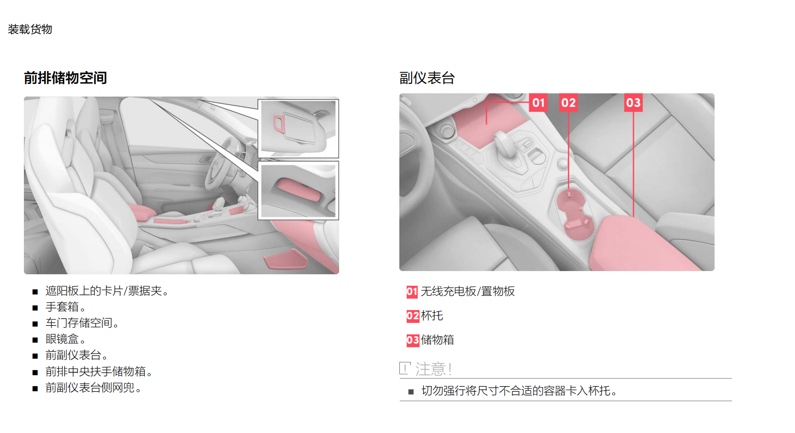
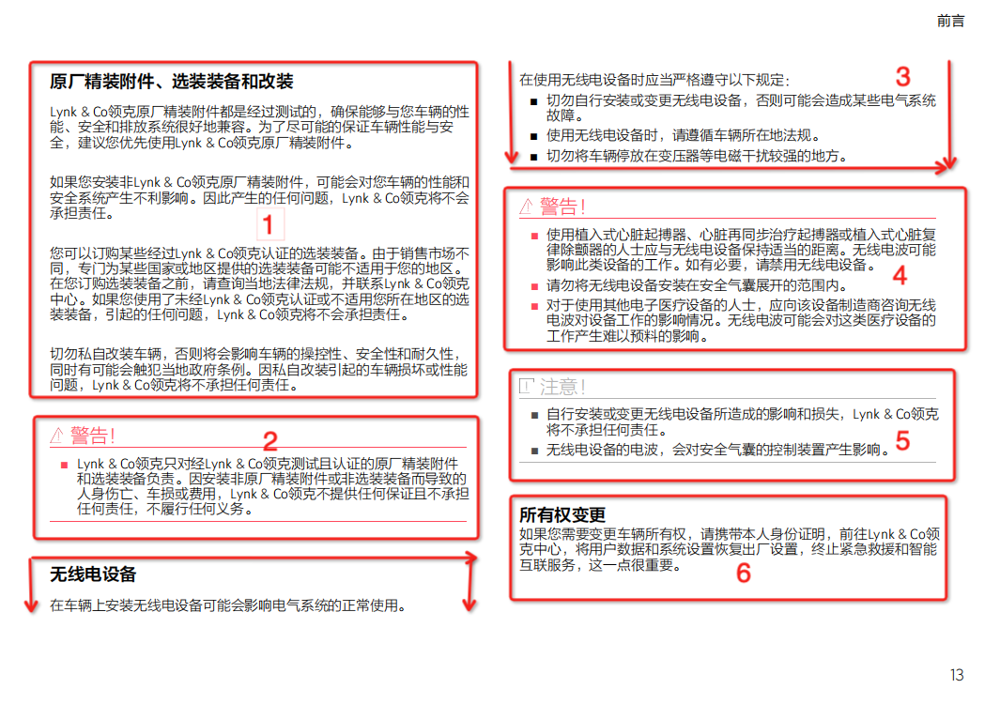
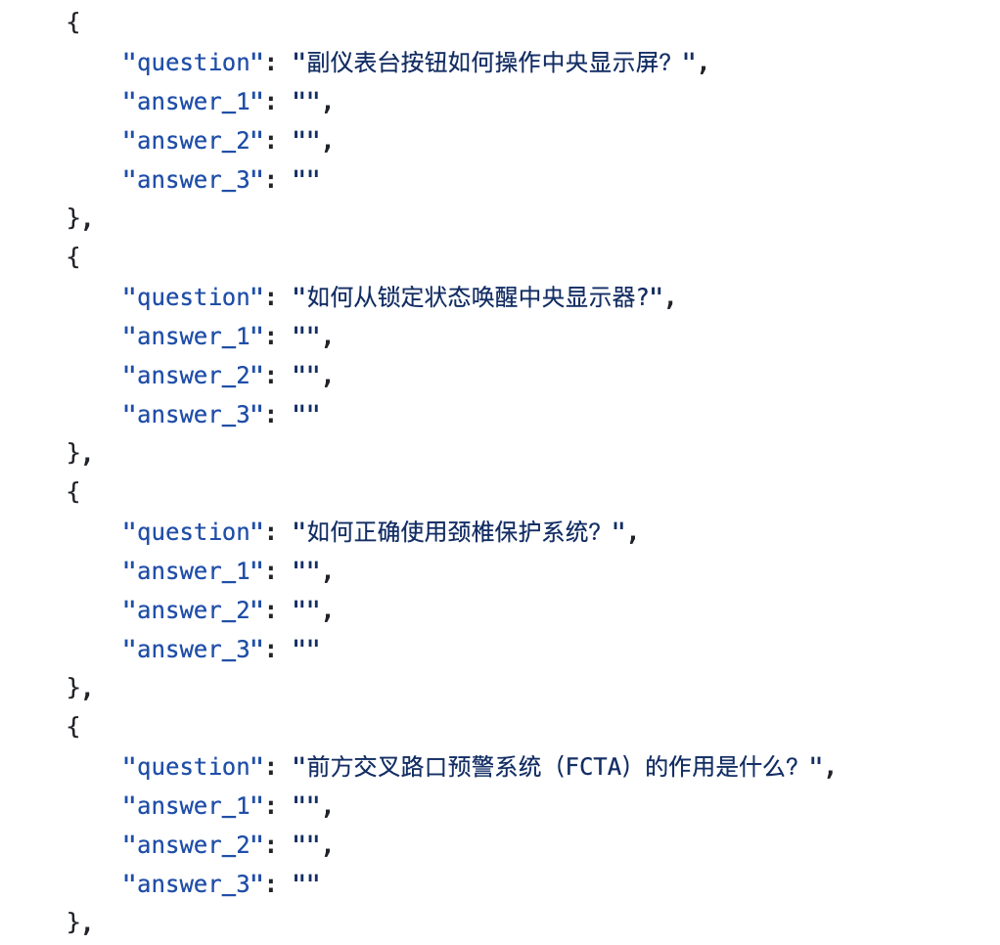
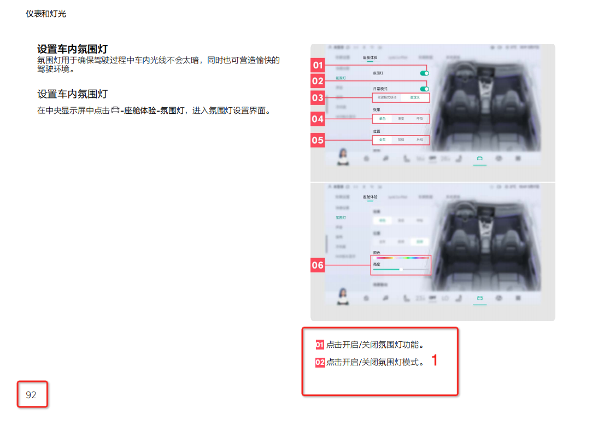
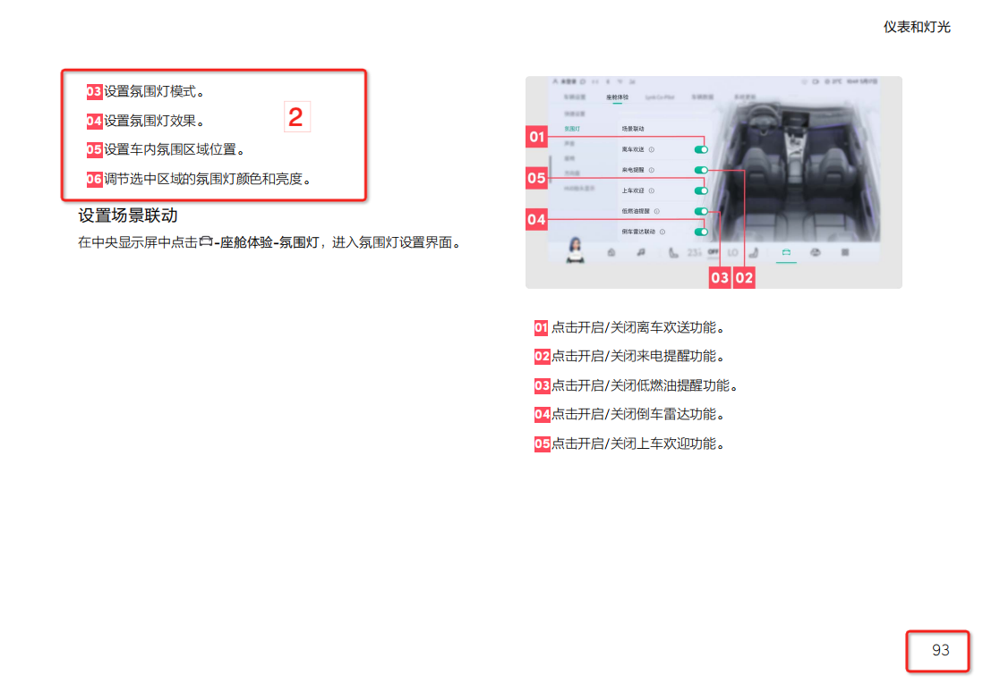
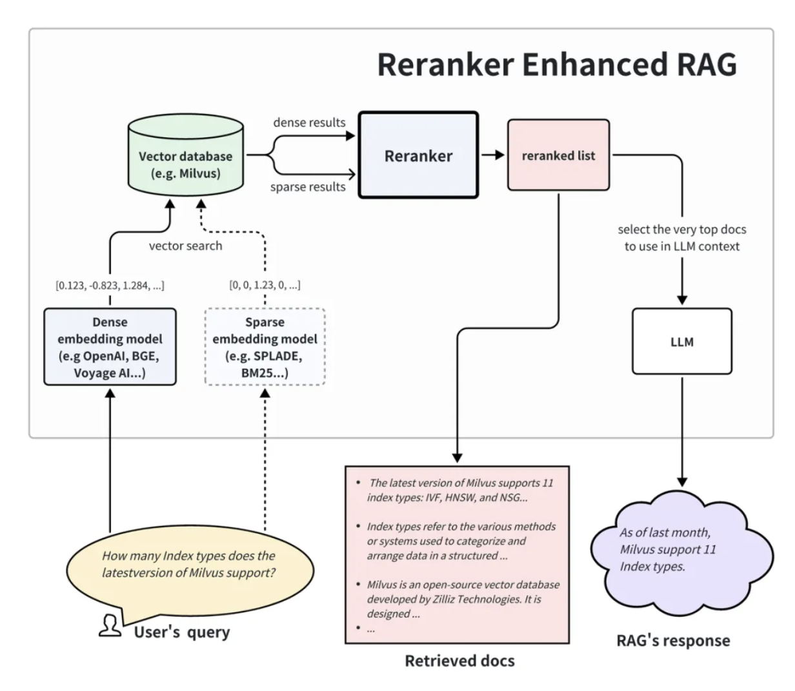

# Smart Car Knowledge Brain

This project belongs to large language model (LLM) Retrieval-augmented generation (RAG) task. It uses the existing owner's manual to build a knowledge base, and then selects relevant knowledge in the base to assist in the generation of LLM. It is mainly divided into three parts: building a knowledge base, knowledge retrieval, and answer generation.

### 1、Structure of the project

```text
.
├── Dockerfile                     # docker file
├── README.md                      # readme file
├── bm25_retriever.py              # BM25 retrieval
├── build.sh                       # 
├── data                           # data folder
│   ├── result.json                # 
│   ├── test_question.json         # 
│   └── train_a.pdf                # User manual file
├── faiss_retriever.py             # faiss retrieval
├── vllm_model.py                  # vllm file to increase speed of generation
├── pdf_parse.py                   # pdf parse file
├── pre_train_model                # pretrain models
│   ├── Qwen-7B-Chat               # Qwen-7B
│   │   └── download.py
│   ├── bge-reranker-large         # bge rerank model
│   └── m3e-large                  # vector retrival
├── qwen_generation_utils.py       # qwen utility functions
├── requirements.txt               # required packages 
├── rerank_model.py                # rerank python file
├── run.py                         # main file                         
└── run.sh                         # main script             
```

### 2 、Introduction

#### 2.1 Document retrieval question answering based on large models

Task: The project creates a Q&A system centered around LLMs to answer users' car-related questions. The system needs to locate the relevant information in the documents based on the questions and generate corresponding answers using LLMs according to the document content. The questions involved in this project mainly revolve around car usage, maintenance, and care. Specific examples are as follows:

Question 1: How do I turn on the hazard warning lights?
Answer 1: The hazard warning light switch is located below the steering wheel. Press the switch to turn on the hazard warning lights.

Question 2: How to maintain the vehicle?
Answer 2: To keep the vehicle in optimal condition, it is recommended to regularly monitor the vehicle's status, including routine maintenance, car washing, interior cleaning, exterior cleaning, tire maintenance, and low-pressure battery maintenance.

Question 3: What should I do if the seat back is too hot?
Answer 3: If your seat back is too hot, you can try turning off the seat heating function. On the multimedia display, click the air conditioning button → seat → heating. In this interface, you can turn off the seat heating.


#### 2.2 dataset

Train data：



Test data：



### 3、Methods

#### 3.1 PDF parser

##### 3.1.1 PDF block parsing



As shown in the figure, we hope the PDF parsing can be done in blocks as much as possible, treating each block as a sample. This way, we can ensure the integrity of the text content in the PDF as much as possible.

##### 3.1.2 PDF sliding window parsing





As shown in Figures 1 and 2, we can see that the context of Figure 1 and Figure 2 is continuous. To ensure the continuity of the text content across pages, we propose the sliding window method.

Specifically, we treat all the content in the PDF as a string, split it by periods, and then apply the sliding window on the resulting array. The details are as follows:

["aa", "bb", "cc", "dd"]

If the string length is 4, the result after applying the sliding window will be:

aabb

bbcc

ccdd

We hope that the sliding window method, like convolution, can use different kernels and strides to find the optimal sample recall coverage.

In simple terms, the sliding window has overlaps, ensuring that the document blocks are as complete as possible, avoiding cutting or skipping important answer steps.


**3.1.3 PDF parsers used in this project**


- **PDF Block Parsing**: This method aims to ensure that a subheading and its corresponding content are within one document block. The lengths of the document blocks are 512 and 1024, respectively.
- **PDF Sliding Window Parsing**: This method splits the document by periods and then constructs a sliding window. The lengths of the document blocks are 256 and 512, respectively.
- **PDF Non-Sliding Window Parsing**: This method splits the document by periods and then evenly divides it according to preset document block sizes. The lengths of the document blocks are 256 and 512, respectively.


#### 3.2 Retrieval 

召回主要使用langchain中的retrievers进行文本的召回。我们知道向量召回和bm25召回具有互补性，前者是深度语义召回，侧重泛化性，后者是字面召回，侧重关键词/实体的字面相关性，这两个召回算法也是工业界用的比较多的，比较有代表性，因此选用了这两个进行召回。


##### 3.2.1 Vector retrieval

Vector retrieval uses FAISS for index creation and search. Use Moka Massive Mixed Embedding as embedding[M3E-large](https://modelscope.cn/models/Jerry0/M3E-large/summary) 。

##### 3.2.2 BM25 retrieval from LangChain

It is typically used to calculate the relevance between two texts or between a text and a document. Therefore, it can be applied in scenarios such as text similarity calculation and text retrieval.


#### 3.3 Rerank

The rationale of Reranker is shown in the picture below.




#### 3.4 Inference Optimization

##### 3.4 vLLM Product-Level Acceleration


vLLM is a Python-based LLM inference and service framework, known for its simplicity and high performance. Through PagedAttention technology, continuous batching, CUDA core optimization, and distributed inference support, vLLM can significantly enhance LLM inference speed, reduce memory usage, and better meet practical application needs. The vLLM inference framework significantly improves the inference speed of large models, achieving up to 1x acceleration compared to regular inference. For product-level deployment, vLLM can handle batch inference requirements and achieve continuous batching under high concurrency, making it widely applicable in real product deployments.

In this project, the Qwen-7B model has been accelerated using vLLM. The project code encapsulates this acceleration logic, which can be found in: vllm_model.py.


#### 3.6 run 

1. In command line：python run.py
2. Using docker：bash build.sh，then run the dockerfile


